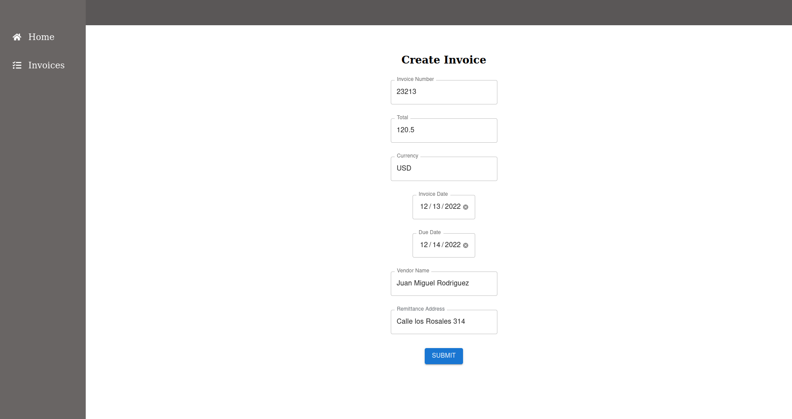
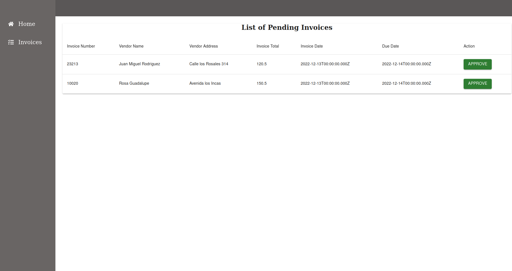

# USTAR Code Challenge

This is an web app that allows you to create and show invoices in real time using GraphQL API with subscriptions.

## Technologies

- [Apollo Client](https://www.apollographql.com/docs/react)

> A library for JavaScript that enables manage data with GraphQL.

## Installation

Create a copy of .env.example with the name `.env`, placed it at the root of the project, and replace its values with your own credentials.

```
REACT_APP_API_URL= http://localhost:8000
```

### Run Project

- Install dependencies.

```
npm install
```

- Run the project.

```
npm start
```

## Project Description

When the application starts you can create an invoice.

<p align="center"> </p>

If you click in the invoices option you show the list of invoices. If an invoice is created it will added at the bottom of the list. Finally, if you click in the approve button the invoice will dissapear

<p align="center"> </p>
